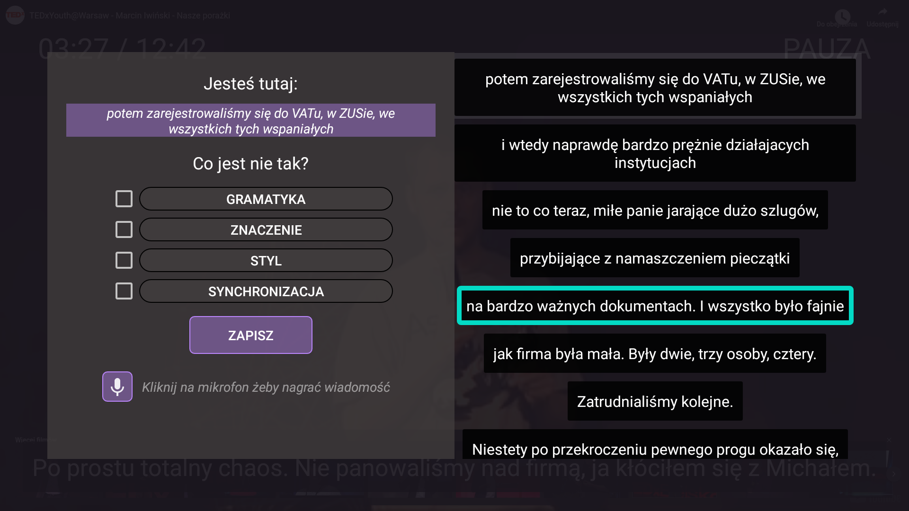
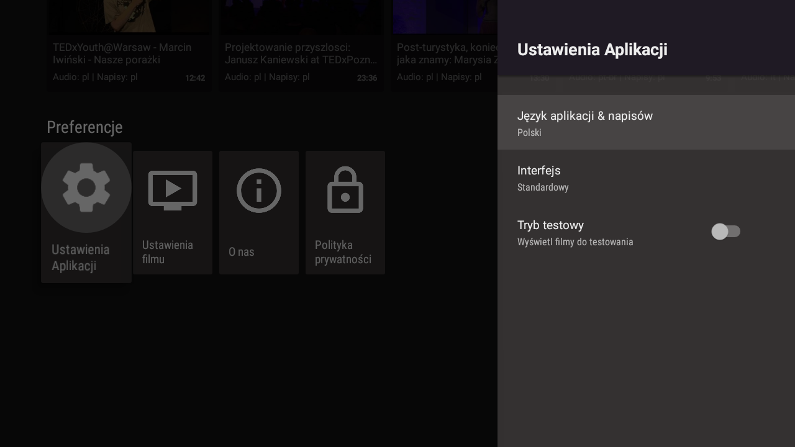

# DREAMTV - Android TV application for Video Subtitle Corrections
 
 [DREAMTV - Middle-ware platform to gather the videos from Amara and save users’ recollected data.](https://github.com/manununhez/dreamtv-server)
 
[DREAM Project](https://sites.google.com/a/unitn.it/rise-dream/)- Social Participation for improving emotional, mental, and physical well-being in independently living older Adults.  

Development of a smart TV application (client side: Android TV platform; server side: Laravel Framework) for the social inclusion of older adults. 

The current version of the DreamTV app runs over Android TV platform. The remote controller is used to interact with the application. The idea is that the user watches some videos, select problem lines and suggests the possible reasons of mistakes. Our aim was to make the application as simple as possible.

First, the user selects a video from the list and starts to watch it. If the user sees an error, they pause the video and an overlay screen shows up (as we can see here). This allows the user to select the possible error, or errors from the : Timing, Grammar, Meaning, Style categories.
The user also has the possibility to send text comments using the voice input of the remote controller. In case the user wants to navigate between subtitles, it is also possible via the subtitle display panel. 

Some basic settings to change the language and level of use of the interface.
