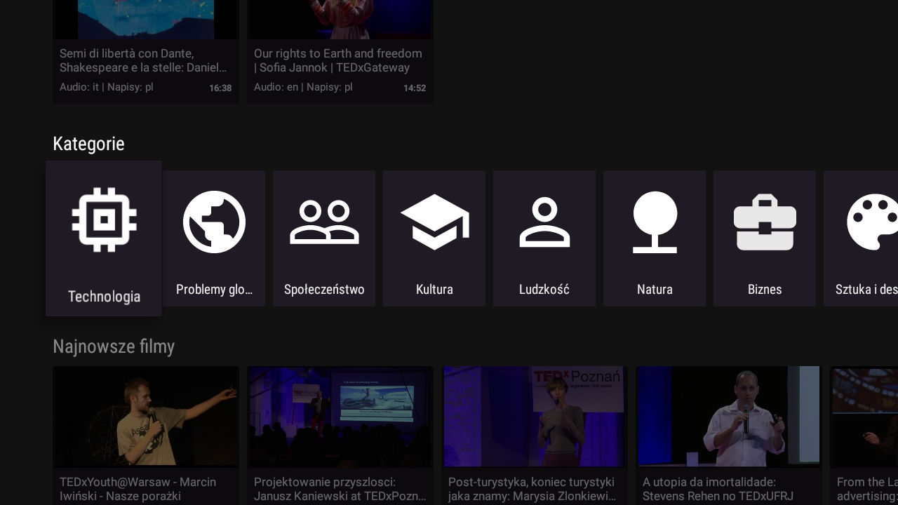

# DREAMTV - Android TV application for Video Subtitle Corrections
 
 
[DREAM Project](https://sites.google.com/a/unitn.it/rise-dream/)- Social Participation for improving emotional, mental, and physical well-being in independently living older Adults.  

Development of a smart TV application (client side: Android TV platform; server side: Laravel Framework) for the social inclusion of older adults. 

### Control your videos with this pilot setting

## Screenshots

